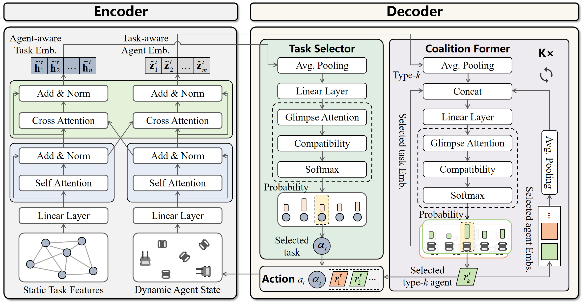

# Co-HeT: A Transformer-based Deep Reinforcement Learning Approach for Collaborative Heterogeneous Robot Scheduling

[](https://opensource.org/licenses/MIT)
[](https://www.python.org/)
[](https://pytorch.org/)

This repository contains the official implementation and baseline algorithms for the paper: **"Co-HeT: A Transformer-based Deep Reinforcement Learning Approach for Collaborative Heterogeneous Robot Scheduling"**.

## 📖 Introduction

Heterogeneous multi-robot systems play a critical role in smart manufacturing and logistics, where robots with complementary capabilities collaborate to execute coupled operations. However, the inherent heterogeneity and interdependence substantially increase scheduling complexity, introducing intricate synchronization constraints and cross-schedule dependencies.

<div align="center">
  
  <p><em>Figure 1: A collaborative scenario in a smart warehouse, where different types of heterogeneous robots (e.g., forklifts, AGVs, mobile manipulators) work together under synchronization constraints.</em></p>
</div>

As illustrated in Figure 1, fulfilling a complex order often requires the synchronized collaboration of forklifts (for heavy lifting), AGVs (for transport), and mobile manipulators (for precise picking). Traditional methods struggle to handle the combinatorial complexity and strict synchronization requirements of such **Collaborative Heterogeneous Robot Scheduling Problems (CHRSP)**.

To address these challenges, we propose **Co-HeT**, a Transformer-based deep reinforcement learning framework. The problem is formulated as a Markov Decision Process (MDP) and solved by Co-HeT through a novel encoder-decoder architecture.


## 🎥 Collaborative Execution Demo

To intuitively illustrate the collaborative mechanism, we provide a visualization of **Co-HeT** solving a medium-scale instance involving **50 coupled tasks**, coordinated by **4 Type-1 robots** and **8 Type-2 robots**.

<div align="center">
  <video src="assets/collaboration.mp4" width="800" controls autoplay loop muted></video>
</div>

The animation demonstrates the complete lifecycle of collaborative tasks under strict synchronization constraints:

* **Asynchronous Arrival & Waiting**: When the first required robot arrives at a task node, the task enters a **Waiting State** (visualized as partially filled nodes), pending the arrival of its heterogeneous partner.
* **Synchronized Execution**: The task transitions to the **Executing State** (solid nodes) only when **both** Type-1 and Type-2 robots are present. This strictly enforces the synchronization constraint required by coupled operations.
* **Completion & Departure**: Upon finishing their respective operations, robots are released to proceed to subsequent tasks.


## 🧠 Model Architecture

Co-HeT employs a specialized encoder-decoder architecture tailored for the heterogeneous and collaborative nature of CHRSP. 

<div align="center">
  
  <p><em>Figure 2: The architecture of the proposed Co-HeT policy network, featuring a dual-stream encoder and a hierarchical decoder.</em></p>
</div>

The architecture consists of two key components:

### 1. Dual-Stream Encoder with Contextual Fusion
To address the functional heterogeneity of the system, the encoder utilizes a two-stage attention process:
* **Parallel Self-Attention Streams**: Separately embed **Static Task Features** (coordinates, deadlines) and **Dynamic Robot States** (current location, time) to capture their distinct characteristics.
* **Bi-Directional Contextual Fusion**: A cross-attention module that bridges the two streams. It enables **Task-to-Robot (T2A)** and **Robot-to-Task (A2T)** information flow, ensuring that task representations are aware of robot availability and vice versa.

### 2. Hierarchical Collaborative Decoder
To tackle the combinatorial complexity of forming robot teams, the decoder adopts a hierarchical decision-making structure:
* **Task Selector**: First, it selects the next task to be scheduled based on the global system context.
* **Coalition Former**: Conditioned on the selected task, this recurrent module iteratively assembles the required robot coalition. It selects one robot for each required type in sequence.

---

## ⚙️ Dependencies

The project is implemented in Python. The core environment relies on the following dependencies:

* **Python** $\ge$ 3.8
* **PyTorch** $\ge$ 1.7 (Optimized for NVIDIA GeForce 4090)
* **Gurobi** (Required for Exact Solver baselines)
* **NumPy** & **Pandas**
* **Matplotlib** (Visualization)
* **tensorboard_logger**
* **tqdm**


## 🚀 Usage
### 1. Training Co-HeT
Train the model using the REINFORCE algorithm with a greedy rollout baseline.
```bash
python run.py --graph_size 20 --run_name 'hrsp_size_20'
```

### 2. Evaluation

To evaluate a pretrained model. The paper reports results using two strategies:

* **Greedy:** Deterministic selection with the highest probability.
* **Sample (Recommended):** Sampling 1280 candidate solutions and selecting the best one.

**Run evaluation with Sampling (Best Performance):**

```bash
python eval.py --datasets N20_K2_M12 --model outputs/N20_K2 --decode_strategy sample --width 1280 --eval_batch_size 1
```

**Run evaluation with Greedy Strategy:**

```bash
python eval.py --datasets N20_K2_M12 --model outputs/N20_K2 --decode_strategy greedy --eval_batch_size 1
```

### 3. Running Baselines

We provide a unified runner `baseline_runner.py` to execute the baseline algorithms compared in the paper, including Exact Solvers and Metaheuristics.

**Supported Algorithms:**

* `ALNS`: Adaptive Large Neighborhood Search
* `IGA`: Iterated Greedy Algorithm
* `DABC`: Discrete Artificial Bee Colony
* `DIWO`: Discrete Invasive Weed Optimization
* `Gurobi`: Exact Solver (Time limit default: 3600s)

**Execution Commands:**

```bash
# Run Metaheuristics
# Run ALNS
python baseline_runner.py --algo ALNS --file N20_K2_M12/N20_K2_M12_I1.xlsx --iter 100 --time 3600

# Run IGA
python baseline_runner.py --algo IGA --file N20_K2_M12/N20_K2_M12_I1.xlsx --iter 100 --time 3600

# Run DABC
python baseline_runner.py --algo DABC --file N20_K2_M12/N20_K2_M12_I1.xlsx --iter 100 --time 3600

# Run DIWO
python baseline_runner.py --algo DIWO --file N20_K2_M12/N20_K2_M12_I1.xlsx --iter 100 --time 3600

# Run Gurobi Exact Solver
python baseline_runner.py --algo Gurobi --file N20_K2_M12/N20_K2_M12_I1.xlsx --iter 100 --time 3600
```


## 🙏 Acknowledgements

We express our gratitude to the authors of the following open-source projects, which served as the foundation for the learning-based baselines compared in this work:

* **Attention Model (AM)**: [wouterkool/attention-learn-to-route](https://github.com/wouterkool/attention-learn-to-route)
* **Heterogeneous DRL (HDRL)**: [chenmingxiang110/tsp_solver](https://github.com/chenmingxiang110/tsp_solver)
* **Token-based DRL (TDRL)**: [Vision-Intelligence-and-Robots-Group/ToDRL](https://github.com/Vision-Intelligence-and-Robots-Group/ToDRL)